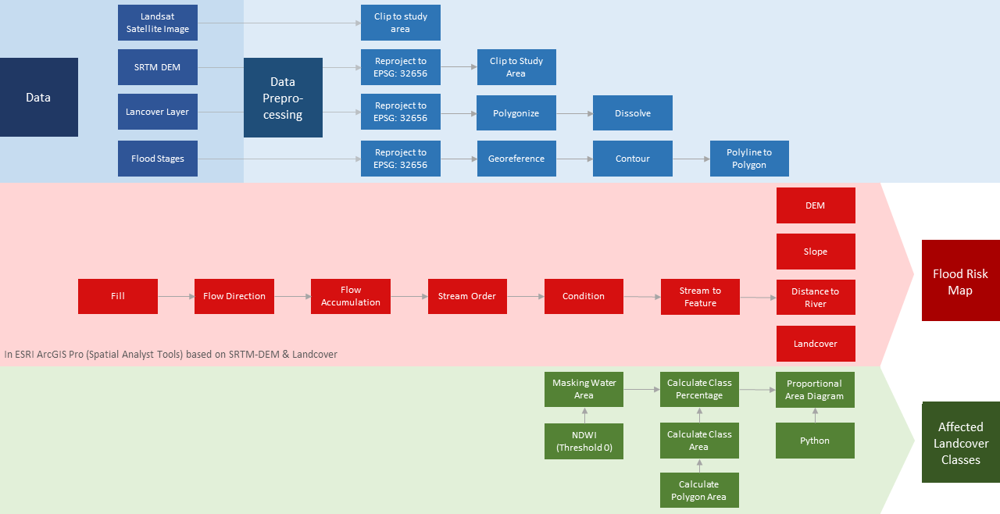
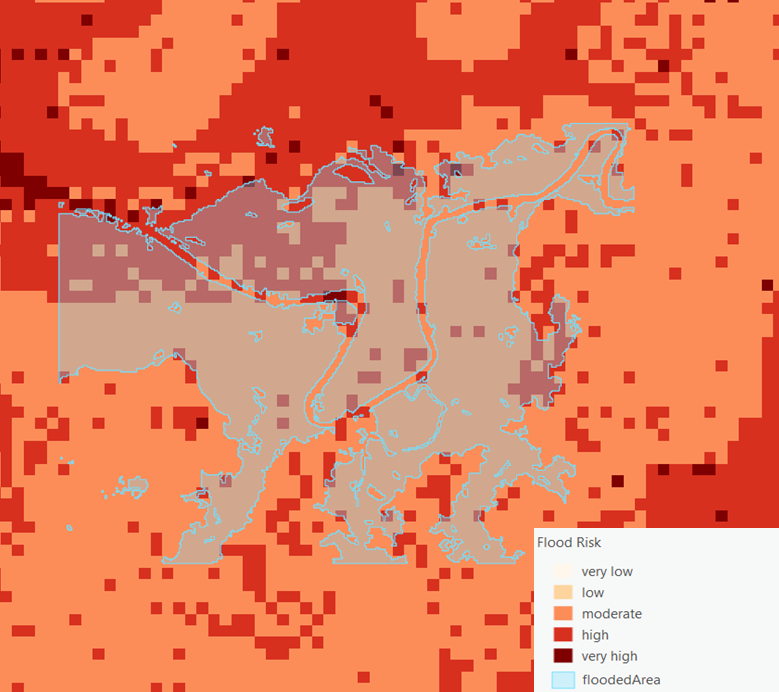

# Flood Analysis in Australia – Flood Risk Mapping and Calculation of Affected Landcover Classes

## Introduction
In this project, risk levels of the area being exposed to flooding were analysed as well as the percentage of affection of the landcover classes for different flood stages. These analyses were developed using QGIS and ArcGIS Pro (ESRI) to utilize both an open source and a licenced software. The aim is to identify how high the risk of flood exposure is in different parts of the area and to determine the extent of exposure [%] of the landcover classes to the actual flood in 2021 and two other flood stages.

## Methodology - Workflow 
The diagram below shows the performed workflow. 



The relevant data sets 
* Landsat satellite image showing the flood: USGS Earth Explorer (https://earthexplorer.usgs.gov/)
* DEM-SRTM: USGS Earth Explorer (https://earthexplorer.usgs.gov/)
* Landcover data (2020): https://maps.dea.ga.gov.au/
* Flood stages: https://www.ses.nsw.gov.au/hawkesbury-nepean-floods

are downloaded and `reprojected` in QGIS to EPSG:32656, the projection of the Landsat satellite image. To reduce computing time and only focus on the specific area, the layers are `clipped` to the study area. The landcover layer needs to be converted to a vector file for further analysis. It is therefore first `polygonized` and then `dissolved`, to only have one row in the attribute table representing each class. The two flood stage layers were `georeferenced` before and outline `contours` are derived, which will be transformed to polygons.

## Risk Map
The aim of mapping flood risk is to assess and display the susceptibility of an area become flooded. This allows, for instance, to indicate who or what will be affected and to which degree of probability. 
The risk map will be developed using ArcGIS Pro based on a DEM and landcover data with Spatial Analyst tools.
For a flood susceptibility analysis, many factors, also including hydrological data like rainfall, can be considered. However, in this project, the following factors are considered:
*	DEM: for determining the topography, it provides information about surface elevation. Low-lying land is more likely to be flooded
*	Slope: affects the velocity of the water flow over the surface. Gentle slopes are more prone to flooding due to a slower runoff
*	Distance to River: Areas close to waterways and -bodies are more likely to inundation
*	Landcover: different landcover types have different permeability levels. It affects how quickly the water infiltrates

The DEM and the landcover data can be used for the risk analysis as they are.
The slope is calculated in ArcGIS Pro with the `slope` tool, which identifies the elevation change for each pixel. 
The distance to river is calculated with the following steps:
1.	`Fill`: removes small sinks and imperfections in the DEM to enhance the accuracy of further calculations
2.	`Flow Direction`: calculates the direction of the water flow for each pixel to its downslope neighbour
3.	`Flow Accumulation`: calculates the pixels contributing flow to each lower-lying pixel in the DEM
4.	`Stream Order`: assigns an order to segments representing the position in the river network to later exclude smaller tributaries
5.	`Con`: selects main channels based on the stream order with the expression:
    Value = 10 or Value = 9 or Value = 8 or Value = 7
6.	`Stream to Feature`: converts the linear network represented in the (Fill) raster to features
7.	Distance to River: `Euclidean Distance`: calculates for each pixel the distance to the closest river feature

The next step is to `reclassify` the four factors which sets them into an appropriate defined number of classes (five). 

Finally, the Overlay tool `Weighted Sum` combines the reclassified factors into one map representing the overall flood risk. Each factor is assigned a weight depending on its relative importance in contributing to the flood risk. The factors have been weighted as follows:
*	DEM: 35
*	Slope: 35
*	Distance to River: 20
*	Landcover: 10

## Affected Landcover Classes
Through this analysis, it is possible to identify which classes are most affected and to what extent. The focus is predominantly on the built-up area, where people are located and it is therefore important to understand how severely they are exposed to which floods.
To determine which of the represented classes are affected by the different flood stages the most, the corresponding inundated areas need to be delineated first. 
The inundated area in 2021 will be delineated using the NDWI:

(GREEN - NIR) / (GREEN + NIR)

A defined threshold of “0 “will mask out the values smaller than zero, which are all values not representing water surface (0,2-1) or flooding/humidity (0-0,2). 

The contours of the other flood stages are already extracted in the data preprocessing steps. 

The Landcover is now intersected with each flood polygon, which will put both attribute tables together so that it is possible to calculate the fractions of the landcover classes within the polygon. 

The calculations can be performed using the `field calculator`. First the total polygon area is calculated in a new field with the expression `$area`, as well as the area of each class within the polygon. Finally, the percentage of each affected landcover class is calculated by dividing the area of each class by the total area and multiplying the result with 100: 

`(Class Area / Total Area) * 100`

The results are visualized with a proportional area chart. This type of diagram is a great way to show distribution proportional to each other within a total area. They will be created in the Python console for each flood stage using the following code (exemplarily for the flood in 2021): 

```Python
import numpy as np
import matplotlib.pyplot as plt
from matplotlib.collections import PatchCollection


def nested_circles(data, labels=None, ax=None, textkw={}):
    ax = ax or plt.gca()
    data = np.array(data)
    R = np.sqrt(data/data.max())
    p = [plt.Rectangle((0, 0), r, r) for r in R[::-1]]

    ax.add_collection(PatchCollection(p, facecolor=colors, edgecolor='none'))

    ax.axis("off")
    ax.set_aspect("equal")
    ax.autoscale()

    if labels is not None:
        kw = dict(color="black", va="center", ha="right")
        kw.update(textkw)
        ax.text(-0.05, R[0]-0.02, labels[0], **kw)
        for i in range(1, len(R)):
            y_offset = (R[i]-R[i-1])/2
            ax.text(-0.05, R[i]-y_offset, labels[i], **kw)

    return p


data = [0.2, 2.6, 2.8, 37.9, 56.5, 100] # percentage values
labels = ["Artificial Surface (0.2%)", "Natural Bare Soil (2.6%)", "Other (2.8%)", "Natural Terrestrial Vegetation (37.9%)", "Cultivated Terrestrial Vegetation (56.5%)", "Total Area (100%)"] 
colors = ["lightgrey", "lightgreen", "darkgreen", "grey", "orange", "red"] 
patches = nested_circles(data, labels, textkw=dict(fontsize=14)) 

plt.title("Affected Landcover Classes in the Flooded Area [%]", fontweight='bold') 
plt.show()

```
## Results
The resulting flood risk map shows that within the extent of the 2021 flood, the average flood risk level is mainly moderate, with some areas with a high risk. There are only rare spots where the risk of inundation is very high, but on the other hand, there is not a single pixel in the entire polygon with a (very) low level of risk.



The results of the landcover analysis display the percentage of the different landcover classes represented in each polygon, to see how strongly each class is affected by each flood stage. It is clearly noticeable that the classes “Cultivated Terrestrial Vegetation” and “Natural Terrestrial Vegetation”, are the most affected at each stage of flooding. Fortunately, the population is only affected by a flood with a fairly low probability of occurrence. In the flood of 2021, which is the subject of this project, the built-up area was mostly left unscathed. This means that the flood prevention measures, like not building houses in high-risk areas close to the river, are successful.


## Conclusion
The production of a risk map representing the flood risk of a specific area based on a digital elevation model and a land cover model can contribute to protecting the population and infrastructure from potential flooding, reducing the risk and costs associated with flooding and combating the effects of climate change. In this project, this type of map provides a useful way to compare the calculated risk level for each pixel with the actual flooding.

Proportional Area Diagrams are valuable for visualising spatial data because they can present the relative proportion of data in an area in a simple way. They are beneficial for quickly identifying differences between data and integrating complex information into simple graphical forms.

